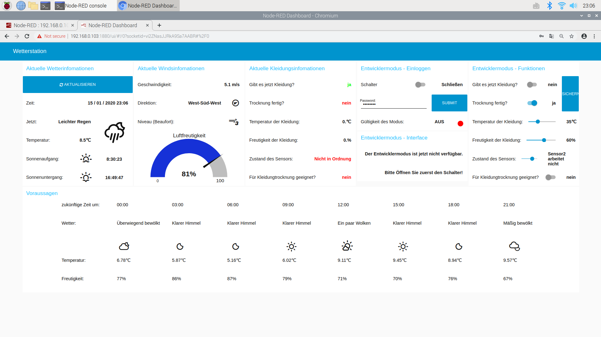
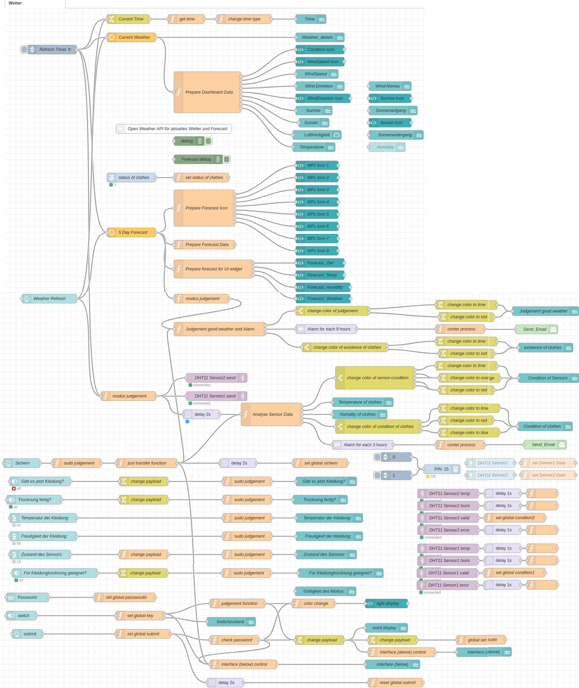
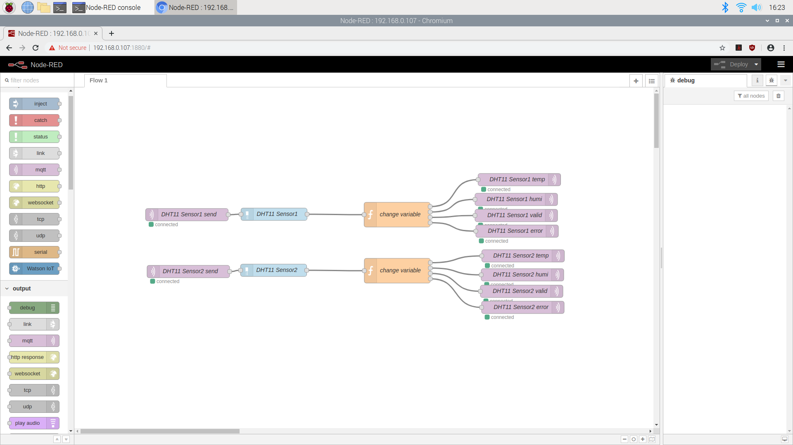

# Intelligent warning system for clothing

### Description
Under the scope of the smart home, this project aims to build an intelligent warning system for clothing. The system is able to receive and update the actual and future weather information, mess the status (dry or wet) of clothes using the sensor, analyze the condition and send the email to the user. Furthermore, this system has an advanced mode so that the user can adjust the settings based on their favor.

Hardware and software which are needed in this project see below.  

#### Hardware

In order to use this system properly, you will need:
- two Raspberry Pi (I use 3B+ and 3B, but 4 should also work)
- two DHT11 sensors
- Cabal and Breadboard

#### Software

Node-Red is used in this project, so you need to set up node-red on your both raspberry pi properly. Docker can also be used, just set up your image properly and make sure you can run Node-Red in your container.

### Usage
Basically you only need to import the two json files in this repo into your node-red front-end. You may need to set up your own password for weather information, etc.

Please follow the instruction file (in German) for details.

### Results

#### Front-end

During usage, you need to use front-end:

#### Back-end

During developing or debugging, you need to use back-end:

The image above should be contained in the main raspberry pi (main-station), and the image below should be in the sub raspberry pi (sub-station).

